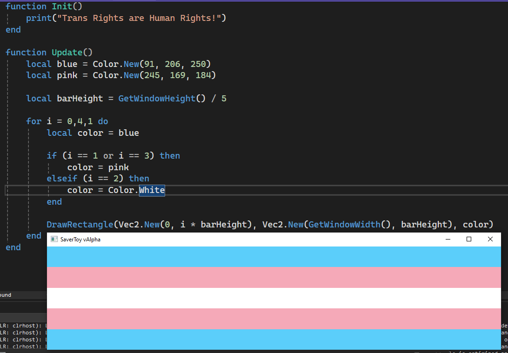

# Midnite

A toy program that allows you to easily create and share screensavers - All written in [Lua](https://www.lua.org/)!

A spirtual successor to [After Dark](https://en.wikipedia.org/wiki/After_Dark_(software)).

## Libraries
- [SFML](https://www.sfml-dev.org/) is used for graphics.
- [MoonSharp](https://www.moonsharp.org/) is used for scripting.

# Docs
You can find all the docs [here](https://robinsaviary.com/midnite/).
